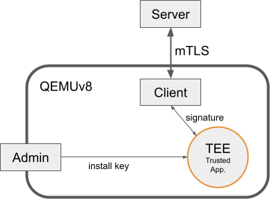

# Demonstration : TLS secure key into OP-TEE
**➡️ Please first read this Linux Embedded article : \<todo_insert_link\>**



This demonstration is inspired by [this article](https://www.amongbytes.com/post/201904-tee-sign-delegator/) from Krys Kwiatkowski.\
This version aims to show how to implement a TLS client-server with BoringSSL on QEMU ARMv8 emulator. Then how to delegate to OP-TEE the signing of the client's private RSA key.


## Build demo

### Initial setup
This demonstration needs the official OP-TEE QEMUv8 emulator and BoringSSL built for host PC and ARMv8 target. Just execute the following script (may take an hour):
```bash
./initial_setup.sh
```
It also prepare needed files for TLS server and client.

### Generate key-pairs
The following script will generate all necessary key-pairs :
```bash
./generate_keys.sh
```


